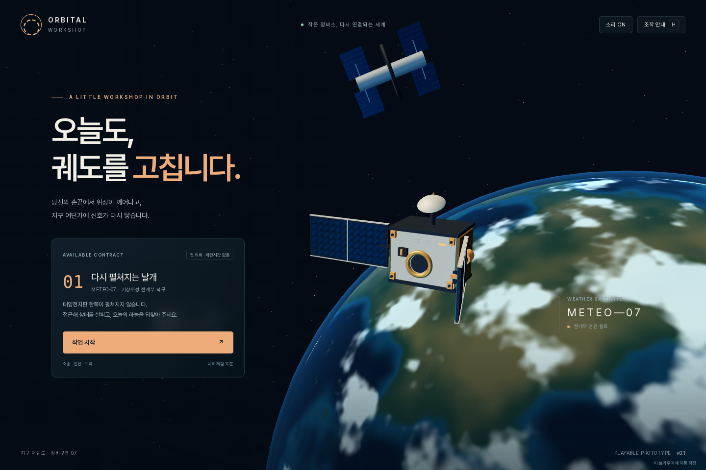

# 궤도 정비소 · Orbital Workshop v0.2

작업선을 조종해 고장 난 위성을 포획하고 수리하는 오프라인 싱글플레이 3D 게임입니다.



## 실행

`PLAY.html`을 Chrome·Edge·Firefox 등 WebGL 2 지원 브라우저에서 열면 설치나 외부 CDN 없이 플레이할 수 있습니다. 파일 주소의 저장 기능은 브라우저 설정에 따라 제한될 수 있습니다.

소스로 실행하려면 Python 3.10 이상에서 다음 명령을 사용합니다.

```bash
python server.py
```

macOS·Linux에서는 `python3 server.py`를 사용할 수 있습니다. 브라우저에서 **http://127.0.0.1:8000**을 엽니다. Windows는 `start_windows.bat`, macOS·Linux는 `sh start_mac_linux.sh`도 지원합니다. 다른 포트는 `python server.py --port 8010`으로 지정합니다.

## v0.2에서 추가한 것

- **3개 의뢰:** 태양전지판 래치 해제 → 배터리 교체 → 안테나 재정렬. 의뢰를 완료하면 다음 임무가 열리며 각 임무의 최고 시간이 기록됩니다.
- **3개 장비:** 정밀 추진기 180 CR, 연료 회수 장치 240 CR, 충격 보호 프레임 320 CR. 장비는 구매 후 다음 출항부터 적용됩니다.
- **비행 개선:** 부드러운 회전 응답, 회전하는 결합부에 맞춘 상대속도 제동, 예상 제동거리, 양쪽 태양전지판 충돌, 접촉면을 따른 반사와 충격 크기에 따른 손상.
- **실습 안내:** 실제 추진·제동 입력에 따라 진행되는 비행 안내와 각 정비 단계의 설명. 안내를 숨기거나 도움말에서 다시 켤 수 있습니다.
- **모바일 조작:** 이동·상하강·회전·제동·미세 모드 버튼과 하단 정비 부품 선택 버튼.
- **진행 파일:** 시작 화면과 일시정지 메뉴에서 JSON 내보내기·불러오기. 미리보기 후 적용하며 기존 저장은 먼저 백업합니다.

## 임무와 성장

| 임무 | 진단 근거 | 수리 방식 | 보상 |
|---|---|---|---|
| METEO-07 · 다시 펼쳐지는 날개 | 전류 정상, 패널 고정 | 전원 분리·고정 후 토크 40–60%로 래치 해제 | 400–500 CR |
| AURORA-12 · 밤을 건너는 전력 | 저전압, 셀 불균형 | 전원 분리·고정 후 배터리 버튼을 길게 눌러 교체 | 550–650 CR |
| RELAY-03 · 멀어진 목소리 | 전력 정상, 지향 오차 | 전원 분리·고정 후 지향 67–77%에서 보정 | 700–800 CR |

수리 뒤에는 전원을 다시 연결하고 작동 시험을 완료해야 보상과 다음 의뢰를 받을 수 있습니다. 충돌·견인 횟수에 따라 추가 보상이 줄어듭니다. 회전 표적 훈련은 보상과 의뢰 해제 없이 조작을 연습하는 모드입니다.

정밀 추진기는 미세 제어와 제동력을 개선합니다. 연료 회수 장치는 추진·제동 연료를 35% 절약하며, 충격 보호 프레임은 선체 손상을 50% 줄입니다. 각 장비는 한 번만 구매할 수 있습니다.

## 조작

| 입력 | 동작 |
|---|---|
| W / S, A / D | 전진·후진, 좌우 추력 |
| Q / E | 하강·상승 |
| Space | 결합부의 속도에 맞춰 제동 |
| Shift + 이동 / 모바일 미세 모드 | 미세 추력 |
| 방향키 / 모바일 회전 버튼 | 수동 자세 조절, 자세 보조 해제 |
| T / 자세 보조 버튼 | 자동 자세 보조 전환 |
| F / 작업 버튼 | 포획·스캔·작업, 수리는 길게 누르기 |
| R / 견인 버튼 | 접근 단계에서 다시 접근 지점으로 이동 |
| 드래그 / 휠 | 카메라 회전·확대 |
| Esc / H | 일시정지 / 도움말 |

포획은 결합부 거리 1.15m 미만, 상대속도 0.48m/s 미만, 방향 오차 14° 미만, 상대 각속도 0.14rad/s 미만에서 가능합니다. 수리 부위는 3D 표식 또는 하단 부품 버튼으로 선택합니다.

## 저장과 불러오기

진행은 단계 변경과 약 2.5초 주기로 브라우저에 자동 저장됩니다. 다른 창이나 탭으로 이동하면 게임이 일시정지됩니다. 진행 중이던 스캔·작동 시험은 다시 시작하고 완료된 단계와 수리 진행은 유지합니다.

v0.1 저장은 자동으로 v0.2 형식으로 옮깁니다. 기존 크레딧과 정밀 추진기, 진행 중인 첫 임무가 유지되며 이전 완료 기록이 있으면 두 번째 의뢰가 열립니다.

`진행 파일 불러오기`에서 1 MB 이하의 v0.1/v0.2 JSON을 선택하고 내용을 확인한 뒤 적용합니다. 취소하거나 유효하지 않은 파일을 선택하면 현재 진행은 바뀌지 않습니다. 저장·백업에 실패해도 기존 진행을 교체하지 않습니다.

복원할 수 없는 브라우저 저장값은 자동 저장으로 덮어쓰지 않습니다. 새 작업을 시작하거나 파일을 불러올 때 기존 원본을 `orbital-workshop-save-v1-recovery-<시간>` 키에 보관합니다. 이 백업은 같은 브라우저 저장소에 있으므로 중요한 진행은 JSON 파일로도 내려받으세요. 파일 주소와 서버 주소는 서로 다른 저장 공간을 사용할 수 있습니다.

## 개발과 검증

Node.js 20 이상을 사용합니다. 게임 자체에는 npm 의존성이 필요하지 않습니다.

```bash
npm ci
npm test
npm run build
npx playwright install chromium
npm run test:e2e
```

- `npm test`: 임무 3종, 진행 해제, 장비 효과, 물리, 튜토리얼, 저장 호환성과 가져오기 실패 보호.
- `npm run build`: 소스·엔진·폰트를 하나로 묶은 `PLAY.html` 생성.
- `npm run test:e2e`: 실제 브라우저 입력, 포획·수리, 모달, 의뢰 선택, 저장 파일, 모바일 터치와 단일 HTML 실행.

E2E는 Python 서버를 자동으로 시작하고 종료합니다. Windows에서는 `python`, 나머지 환경에서는 `python3`를 기본 사용합니다. `PYTHON`, `PLAYWRIGHT_MODULE`, `ORBITAL_CHROMIUM_EXECUTABLE`, `ORBITAL_TEST_PORT`, `ORBITAL_SCREENSHOT_DIR`로 환경을 지정할 수 있습니다. 새 임무의 수리 테스트는 정상적으로 생성한 저장 파일을 실제 불러오기 UI로 적용합니다. 첫 임무 접근은 실제 키보드 입력으로 수행합니다.

## 코드 구조

| 파일 | 역할 |
|---|---|
| `web/src/contracts.js` | 임무, 부품, 장비, 해제와 수리 조건 |
| `web/src/mission.js` | 시뮬레이션과 정비 상태 전이 |
| `web/src/physics.js` | 선체·패널 접촉과 충돌 반응 |
| `web/src/storage.js` | 보상·구매·버전 마이그레이션·백업·불러오기 |
| `web/src/tutorial.js` | 행동과 임무 단계에 따른 안내 |
| `web/src/main.js` | 입력·UI·저장·게임 루프 |
| `web/src/scene.js` | 3D 위성, 수리 연출, 카메라 |
| `tests/` | 단위·브라우저 회귀 테스트 |

## 배포와 범위

`render.yaml`은 Python Web Service 설정입니다. 시작 명령은 `python server.py --host 0.0.0.0`, 상태 확인 경로는 `/healthz`이며 포트는 `PORT` 환경변수를 읽습니다. 정적 호스팅에는 `web` 폴더를 사용할 수 있습니다. 이번 버전에서 실제 서비스 배포는 수행하지 않았습니다.

운동과 충돌은 게임을 위한 단순화 모델입니다. 완전한 궤도역학·정밀 접촉 해석·실제 토크 측정은 제공하지 않습니다. 모바일은 브라우저 에뮬레이션으로 검증하며 실제 iPhone·Android 기기와 모든 브라우저 조합의 검증은 별도입니다. 다인 플레이는 지원하지 않습니다.

## 라이선스

프로젝트 코드는 MIT, 포함된 Three.js 0.180.0은 MIT, Pretendard 1.3.9는 SIL Open Font License 1.1입니다. `LICENSE`, `web/vendor/THREE-LICENSE.txt`, `web/fonts/OFL.txt`, `THIRD_PARTY_NOTICES.md`를 참고하세요.
